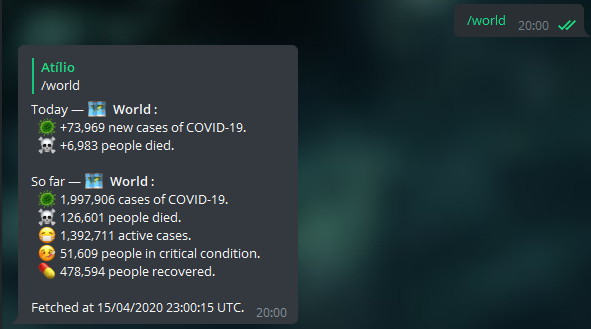
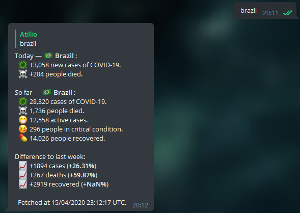
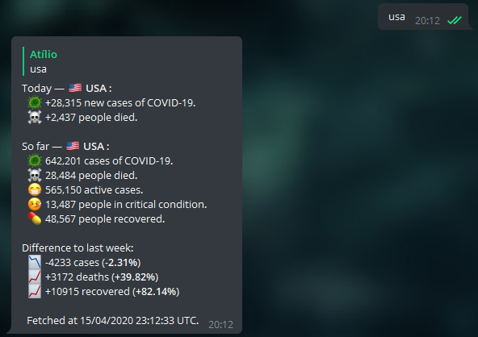
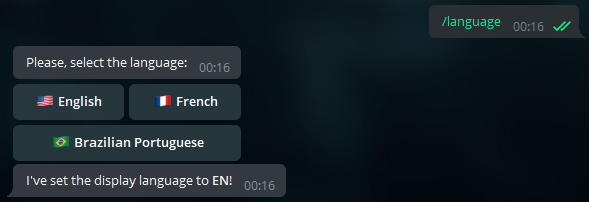

<h1 align="center">
   
    
   
  <a href="https://t.me/COVID19NOWBot">🦠 COVID19NOWBot</a>
   
</h1>

<h4 align="center"><a href="https://t.me/COVID19NOWBot">@COVID19NOWBot</a> - Telegram bot to fetch numbers of COVID-19 cases. Available in 🇺🇸, 🇧🇷 and 🇫🇷.
</h4>

<h5 align="center">

   

</h5>

## ℹ About

Telegram bot that consumes APIs and makes information available through a [Telegram](http://telegram.org/) bot. It runs on JavaScript (Node.js) and uses MongoDB. You can [try it here](https://t.me/COVID19NOWBot) (available in en-US, pt-BR and fr-FR).

## 📖 Examples (in en-US)

- Getting stats for the world:

  

- Getting stats for countries:

  
  

- Changing locale (to en-US):

  

You can learn more with the `/help` command.

## 🏡 Running locally

1- First, clone the repository and enter the folder with your terminal. Then, install all dependencies with

`npm install` or `yarn`

Some of the bot's functionality depends on being connected to a MongoDB database. If you wish to use your own database, just set the `MONGODB_URI` environment variable in the `.env.example` file to your URI connection string and rename the `.env.example` file to `.env` or, alternatively, set `MONGODB_URI` as an environment variable of the system hosting the bot.

You'll be doing the same thing for the `BOT_TOKEN` environment variable. You can get your token/key with [BotFather](t.me/BotFather), the official way to create bots on Telegram.

With everything set, you can start the bot with (nodemon is optional for hot reloading):

`nodemon index.js`

---

Data sources: JHU CSSE, Worldometer and [covid19-api on NPM](https://www.npmjs.com/package/covid19-api#-references).
